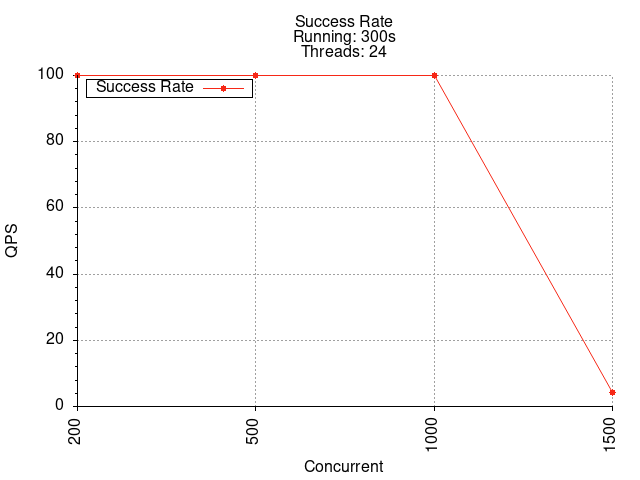

# HTRPC

[简体中文](./README.md) | English

## Features:
* Implemented a Simplified SPI Mechanism: Developed a custom SPI mechanism allowing configuration-based customization of components such as compression, serialization, and registry centers.
* High-Performance Network Communication with Netty: Utilized Netty, based on NIO, to achieve high-performance network communication, boosting the system's QPS from 200 to over 3500.
* Connection Management: Employed a heartbeat mechanism to maintain persistent connections between the server and client, minimizing the overhead of reconnections.
* Dynamic Proxy for Simplified Usage: Leveraged JDK dynamic proxies to abstract remote method calls and load balancing details, streamlining the framework's usability.
* Spring Integration for Dependency Management: Used Spring's IOC container to manage Beans, enabling service registration and service reference retrieval via annotations.
* Spring Boot Integration: Developed a Spring Boot Starter to facilitate the automatic initiation of RPC servers through annotations.

## Metrics
### HTRPC

### Dubbo

