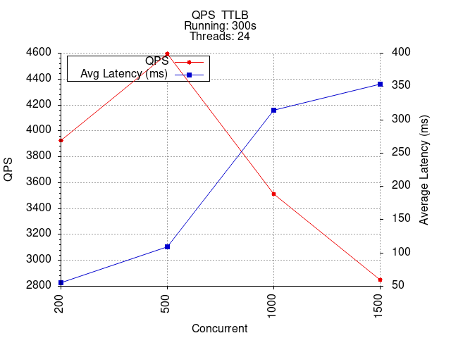
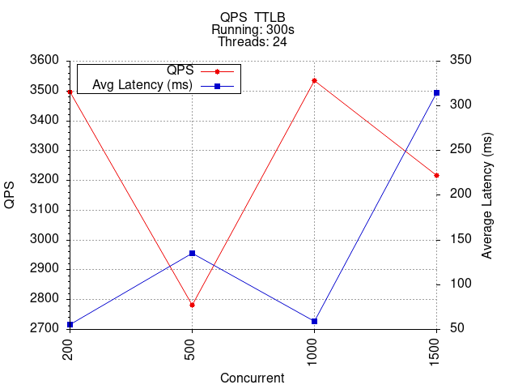
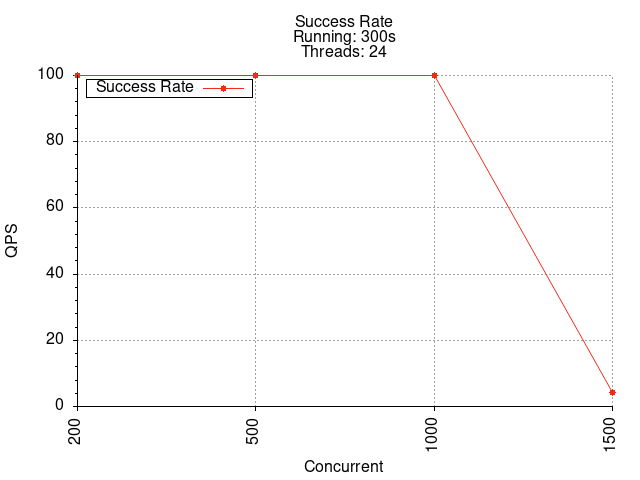

# HTRPC

简体中文 | [English](./README-EN.md)

## 特点：
* 实现了简易的 SPI 机制，可以通过配置文件自定义压缩、序列化、注册中心等组件。
* 使用基于 NIO 的 Netty 实现了高性能网络通信，系统 **QPS 从 200 提升到 3500 以上**。
* 服务端和客户端之间使用心跳机制保持连接，减少重新连接的额外开销。
* 通过 JDK 动态代理屏蔽了远程方法调用和负载均衡等细节，简化了框架的使用。
* 利用 Spring 框架的 IOC 容器管理 Bean，实现通过注解自动注册服务和获取服务引用。
* 集成 SpringBoot 并编写 Starter ，实现通过注解自动执行 RPC 服务端的启动。

## 性能对比：
### HTRPC

### Dubbo

